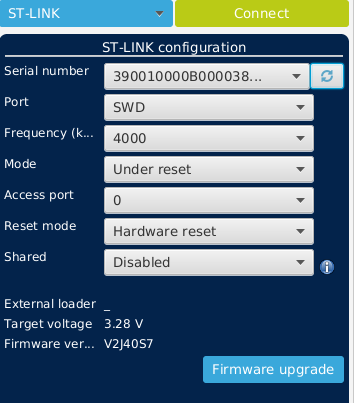
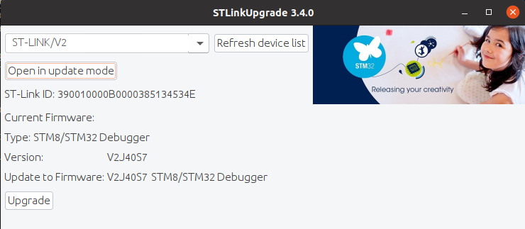
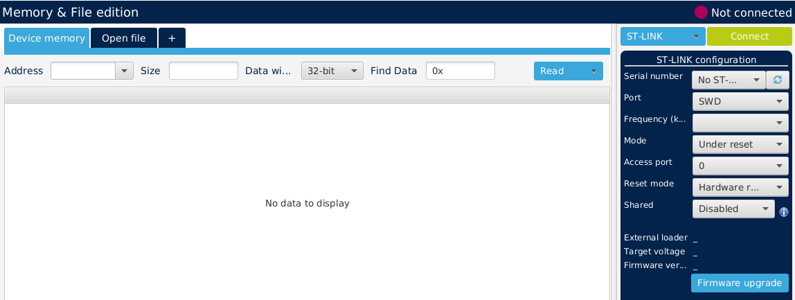
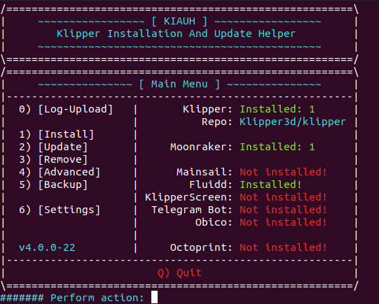
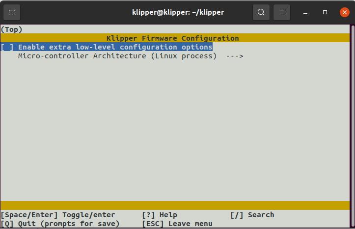
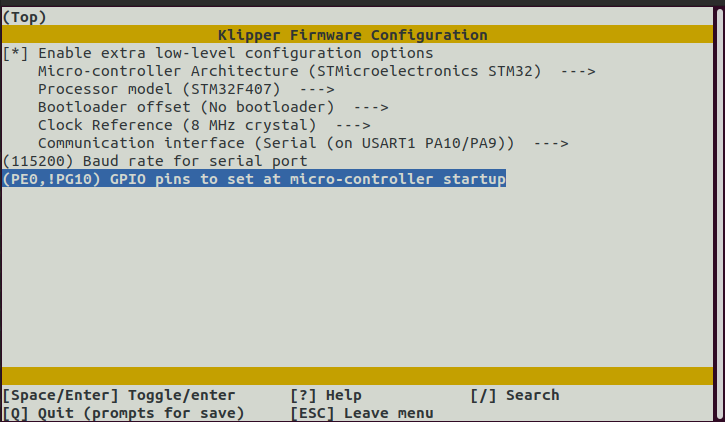

# QIDI-Klipper
Here i collect all my expertise on how to install klipper on our QIDI X-Plus. X-Max.

Starting from the work of Funkton and ecsv (thanks to them) i'm trying to collect every info on this page

# Configuration  
- [QIDI-Klipper](#qidi-klipper)
- [Configuration](#configuration)
  - [BOM](#bom)
  - [Install ST Link v2 and upgrade](#install-st-link-v2-and-upgrade)
  - [Dump Current Firmware](#dump-current-firmware)
  - [Install Klipper](#install-klipper)
  - [Compile klipper](#compile-klipper)

## BOM

First of all you neead an ST-link v2 to dump and flash klipper.bin
you can buy from [amazon](https://www.amazon.it/gp/product/B07YX83NSL/ref=ppx_yo_dt_b_asin_title_o05_s00?ie=UTF8&psc=1) or [aliexpress](https://it.aliexpress.com/item/32887597480.html?spm=a2g0o.productlist.0.0.35235251njfsds&algo_pvid=8298341a-c818-41ff-bc0b-aa8cfb25572f&algo_exp_id=8298341a-c818-41ff-bc0b-aa8cfb25572f-3&pdp_ext_f=%7B%22sku_id%22%3A%2265696129095%22%7D&pdp_npi=2%40dis%21EUR%212.94%212.59%21%21%211.42%21%21%402100bdd816642914796751384e409f%2165696129095%21sea&curPageLogUid=54v8GDPXkiuv)

You need a raspberry. Starting from model 3b+ everythings works. If you don't want to use raspberry you can also use a minipc but you need ad [usb-ttl cable](https://www.amazon.it/gp/product/B083HVM7VZ/ref=ppx_yo_dt_b_asin_title_o00_s01?ie=UTF8&psc=1)

[Dupont cables](https://www.amazon.it/HeyNana-Dupont-Multicolore-maschio-femmina/dp/B0965R9J21/ref=sr_1_5?__mk_it_IT=%C3%85M%C3%85%C5%BD%C3%95%C3%91&crid=AG7PRWLL9GE3&keywords=dupont&qid=1664291717&qu=eyJxc2MiOiI1LjM5IiwicXNhIjoiNC41MiIsInFzcCI6IjMuODgifQ%3D%3D&s=electronics&sprefix=dupont%2Celectronics%2C108&sr=1-5), to connect raspberry to mainboard or as said before usb-ttl cable


## Install ST Link v2 and upgrade

Following steps are for Ubuntu. I did some test with windows but i wasn't able to get stlink working correctly.

First of all download STM32cubeProg 2.7. Follow [this link](https://www.st.com/en/development-tools/stm32cubeprog.html#get-software)
on right select 2.7 version and download. When you press to download it ask you to register, follow registration steps and after you get STM32cubeProg.

Double click on SetupSTM32CubeProgrammer-2.7.0.linux and follow steps for installation.

Launch STM32cubeProg and plug STLink, click on refresh icon (top right) and you'll see a long number on Serial number. If you see it everything it's working.



Close STM32CubeProg. Now you need to download STLINK007 to upgrade your ST-Link. Go to [Download page](https://www.st.com/content/my_st_com/en/products/development-tools/software-development-tools/stm32-software-development-tools/stm32-programmers/stsw-link007.license=1664260122653.product=STSW-LINK007.version=3.10.3.html) and download latest version. Extract, inside AllPlatform you find STLinkUpgrade.jar, double click and it will open.

Unplug STLink and re-plug it, now click on refresh Device list and after click on Open in update mode.

Check if a new version of firmware are ready and in case press Upgrade



In below image **Version** and **Update to Firmware** are the same so i don't need to upgrade. After upgrade close window.

let's go to next chapter, Dump current Firmware

## Dump Current Firmware

Open bottom panel of your Qidi printer, remove all screws, take some photos of mainboard connections ( some photos will be uploaded on images/mainboard) and remove mainboard.

I suggest to remove because it's easier to plug dupont cables, flash firmware and test with klipper.

With dupont calbles connect STLink to Main board, folloing this schema:

| STLink | mainboard |
| :---:   | :---: |
| 3.3V | 3V|
| SWCLK | SWCS |
| GND | GND |
| SWDIO | SWI


Connect STLink to your computer and press __connect__ 



___Note___: if you already have klipper installed you need to press reset button and keep it pressed while you click connect and relase after it connected

On ___Address__ insert ___0x08000000___ on ___Size__ insert ___0x80000___ and press read. If everything is ok you'll see a table below the bar full of data, now press the arrow in Read button and click on __Save as ...__ and save your firmware.

Dimensions should be near 524 KB

## Install Klipper

Now you need a raspberry, you can install __imager__ from [here](https://www.raspberrypi.com/software/), once you have installed open imager click on Operative System -> Raspberry Pi OS (other) and select __Raspberry Pi OS Lite (64)__ remember to install the lite version, you don't need UI.

On Imager on Bottom right click on settings (gear icon) click on __Enable SSH__ and leave __use password authentication__. On set Username and password insert an user (please different from pi) and insert a real password (different from raspberry).

Now click on __Configure wirelesss lan__ and insert yout SSID and password.

If you use ethernet cable you can skip last configuration.

Power in your raspberry, look on your router when it connect and copy the IP.

Now if you use windows open putty and configure raspberry ip with user and password, if you use linux distro open terminal and press

__ssh user@ip__ it ask you for password. Now that you are inside your raspberry you can install [__KIAUH__](https://github.com/th33xitus/kiauh). Before installing it update and upgrade your rasp __sudo apt update__ and __sudo apt upgrade__ after that install git __sudo apt install git__ (press Y when it ask you to install)
now download KIAUH 
``` 
cd ~
git clone https://github.com/th33xitus/kiauh.git
./kiauh/kiauh.sh
``` 


Press 1 for Install and select Klipper (press 1), when it complete press again 1 for install and install Moonraker (press 2) repeat for fluidd or mainsail (press 4 for fluidd, 3 for Mainsail)

When you press B you will see an image like one posted here.
Press Q and exit.

Open a new page on your browser and past the ip of your raspberry, if everything it's ok you will see the fluidd or mainsail webpage

Congratulations klipper it's correctly installed (don't worry about the error on mcu we will fix later)

## Compile klipper

Now we need to compile klipper and install in our main board. follow carefully next steps

open putty/terminal and connect to your raspberry, in home folder you find a __Klipper folder__

```
cd klipper
make menuconfig
``` 

if you see an error like 
```
locale.Error: unsupported locale setting
```
simply copy this on terminal and press enter
```
export LC_ALL=C
```
now you see this menù



press space bar to enable extra low level configuration, 
press space bar on Micro-controller and select __STM32__
Press space bar on processor model and select __STM32F407__
Press space bar on bootloader offset and select __No bootloader__
Press space bar on Communication Interface and select __Serial (on USART1 PA10/PA9)__
Now on baud rate insert 115200
and last on on GPIO Pins insert __PE0, !PG10__

configuration must be like this one



Now press ESC and save

